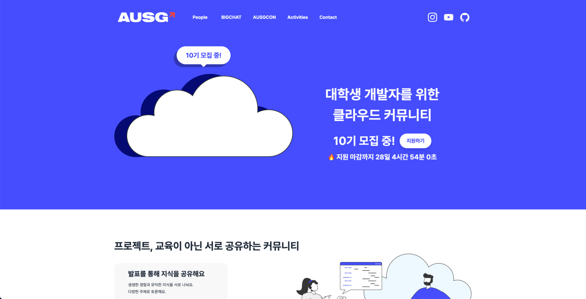

<br />
<div align="center">
  <a href="https://github.com/othneildrew/Best-README-Template">
    
  </a>

  <h3 align="center">ausg.me</h3>

  <p align="center">
    AUSG 공식 홈페이지
    <br />
    <br />
    <a href="https://ausg.me"><strong>AUSG 홈페이지 바로가기 »</strong></a>
  </p>
</div>

## Overview



## Development

ausg.me 프로젝트는 [Next.js](https://nextjs.org/)와 [Typescript](https://www.typescriptlang.org/), [TailwindCSS](https://tailwindcss.com/) 로 만들어졌습니다.

패키지 매니저는 최신 버전의 [NPM](https://npmjs.com) 을 사용합니다.

### Install Packages

```sh
npm install
```

### Starts the application in development mode

```sh
npm run dev
```

## Deploy

현재 Vercel의 AUSG Organization에 배포되어 있습니다.

main 브랜치에 코드 변경사항이 푸쉬되면 Github Action에 의해 자동으로 배포됩니다.
<br />
단, main 브랜치는 보호되고 있기 때문에, PR을 통해 코드를 병합해야 합니다.


브랜치 이름이나 PR에 대한 규칙은 특별하게 정해져 있지 않습니다.

## How to add yourself to the People page

AUSG 구성원들은 [People 페이지](https://ausg.me/people)에 사진과 함께 간략한 자기소개를 등록할 수 있습니다.

1. 새로운 브랜치를 생성한 뒤 작업하기

2. public/people 경로에 본인 사진 업로드
    * 만약 페이지에서 사진이 잘리거나 이상하게 나온다면, 사진을 잘라서 편집한 뒤에 업로드하면 됩니다.

3. data/people.json 파일에 아래 형식의 자기소개 객체 추가
    ```
      {
        people: [
          ...
          {
            "year": "6th", // 본인 기수에 맞춰 입력 ("1st", "2nd", "3rd", "4th", "5th" ... 형식)
            "name_ko": "배진수", // 한글 이름
            "name_en": "Jinsu Bae", // 영어 이름
            "photo": "naru200.jpg", // 프로필 사진 파일명(확장자 포함)
            "short_bio": "짧은 소개 메시지. 공백 포함 100자 제한. 100자를 넘기면 표시되지 않음.",
            "role": "Regulator", // Optional: 운영진만 입력 ("Regulator" 또는 "Organizer"). 일반 구성원은 생략
            "linkedin_username": "naru200", // Optional: 링크드인 유저네임 (본인 프로필 페이지 주소에서 확인 가능)
            "github_username": "naru200", // Optional: Github 유저네임 (본인 프로필 페이지 주소에서 확인 가능)
            "homepage_url": "https://exampleblog.com" // Optional: 홈페이지 또는 블로그 URL
          }
        ]
      }
    ```
    * `photo` 값은 반드시 업로드한 프로필 사진의 파일명과 동일하게 설정해야 합니다. (확장자까지!)
    * `linkedin_username` `github_username` `homepage_url` 값을 기반으로 Linkedin/Github 프로필 링크와 홈페이지(블로그) 링크가 걸리게 됩니다.
    * 링크가 걸리는 걸 원치 않는다면 `linkedin_username` `github_username` `homepage_url` 값은 입력하지 않아도 됩니다.

이미 등록된 정보를 수정하고 싶다면 data/people.json 의 JSON 객체를 수정하면 되고, 사진을 변경하고 싶다면 public/people 경로에 동일한 파일명으로 기존 사진을 덮어씌우면 됩니다.
다른 사람의 정보를 수정하지 않도록 주의해 주세요.

## Credits

이 사이트의 초석을 세운 개발자들에게 감사를 전합니다. 2022년 AUSG 홈페이지 리뉴얼 프로젝트를 시작하고 지금의 모습이 있기까지 기반을 다진 분들입니다.

<p align="center">
  <a href="https://github.com/eunsukimme">
    
  </a>
  <a href="https://github.com/naru200">
    
  </a>
</p>

## Contact

AUSG에 궁금한 점 및 문의사항이 생겼다면, AUSG 홈페이지의 Contact 페이지를 통해 저희에게 연락할 수 있습니다.
<br />
누구나, 언제든, 무엇이든 환영입니다!

<a href="https://ausg.me/contact"><strong>지금 당장 AUSG에 문의하기 »</strong></a>
